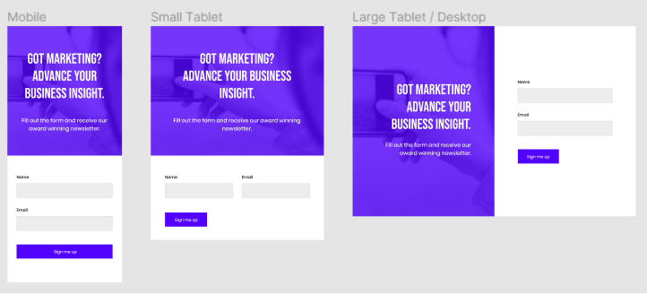

<h1>Project_landing Page</h1>
This is a practice for use a responsive projec, here we are going to learn how to identify breakpoints from a figma design.

Here, the main idea is use the flexbox or @mediaqueries for responsive design.

## Built With

- Just! HTML & much patience

HTML
CSS

## Authors

👤 **Author1**

- GitHub: [@Edjhernandez](https://github.com/Edjhernandez)
- Twitter: [@EdjhernandezM](https://twitter.com/EdjhernandezM)
- LinkedIn: [@LinkedIn](https://linkedin.com/in/eduardo-jose-hernandez-marin-53b27358/)

## 🤝 Contributing

Figma designer

## Show your support

Give a ⭐️ if you like this project!

## Acknowledgments

- Beginners Inspiration

## 📝 License

This project is [MIT](./MIT.md) licensed.